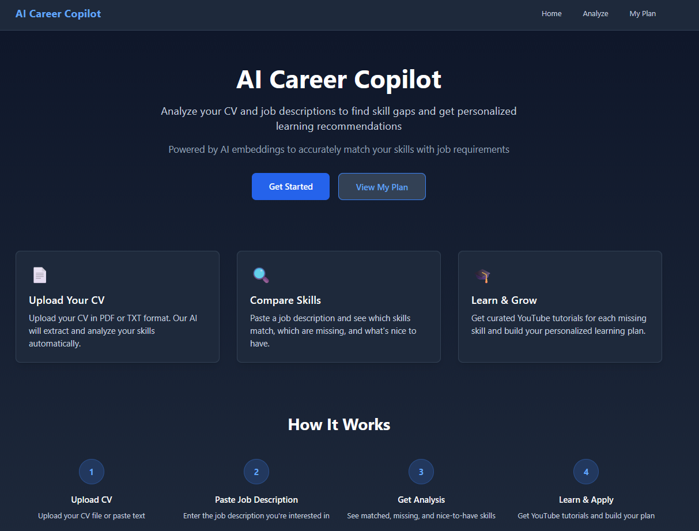
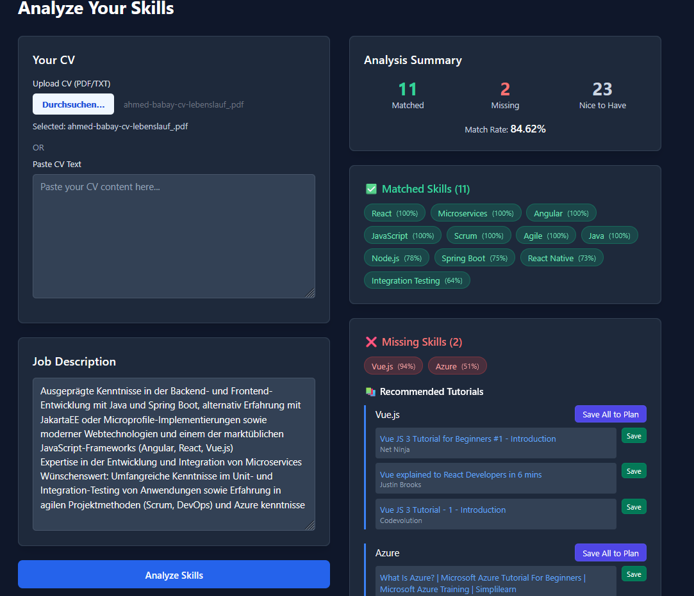
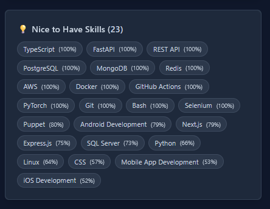
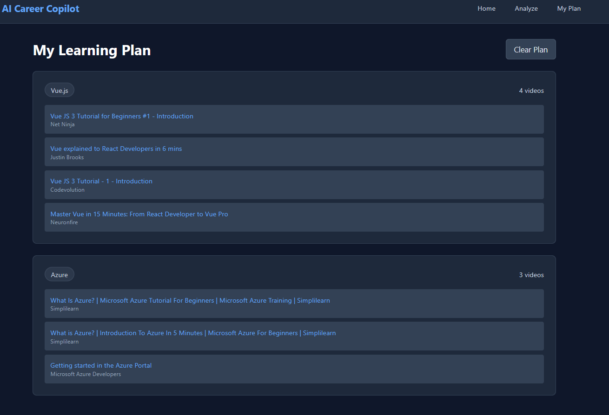

# AI Career Copilot — Skill Gap & Learning Recommender

Analyze a CV and a target job description using a lightweight and fast AI Embedding Model locally without being dependent on Huggingface API or server to detect skill gaps. You will get free YouTube tutorials for each missing skill. 
Frontend (Next.js) + Backend (Express) with Hugging Face embeddings. 
Runs locally.

## Screenshots 






## Quick Start

1) Install dependencies (backend + frontend):

```bash
npm install
```

2) Create env files:
- `backend/.env`
```
PORT=3001
YOUTUBE_API_KEY=your_youtube_api_key_here
NODE_ENV=development
```
- `frontend/.env.local`
```
NEXT_PUBLIC_API_URL=http://localhost:3001
```

3) Run both apps (dev):

```bash
npm run dev
```

- Frontend: http://localhost:3000
- Backend health: http://localhost:3001/health

## Scripts

- `npm install` → installs backend and frontend
- `npm run dev` → runs backend and frontend concurrently
- `npm run start` → production start for both (after building each app)

## Features

- Upload CV (PDF/TXT) or paste text
- Paste job description
- Embedding-based skill extraction + comparison (matched / missing / nice-to-have)
- YouTube tutorials for missing skills
- Save tutorials to "My Plan" (localStorage)


## Tech Stack

- Frontend: Next.js (App Router), Tailwind CSS
- Backend: Express.js, pdf-parse, @xenova/transformers (embeddings)
- Data: Local `skills.json`
- External: YouTube Data API v3

## License

MIT
